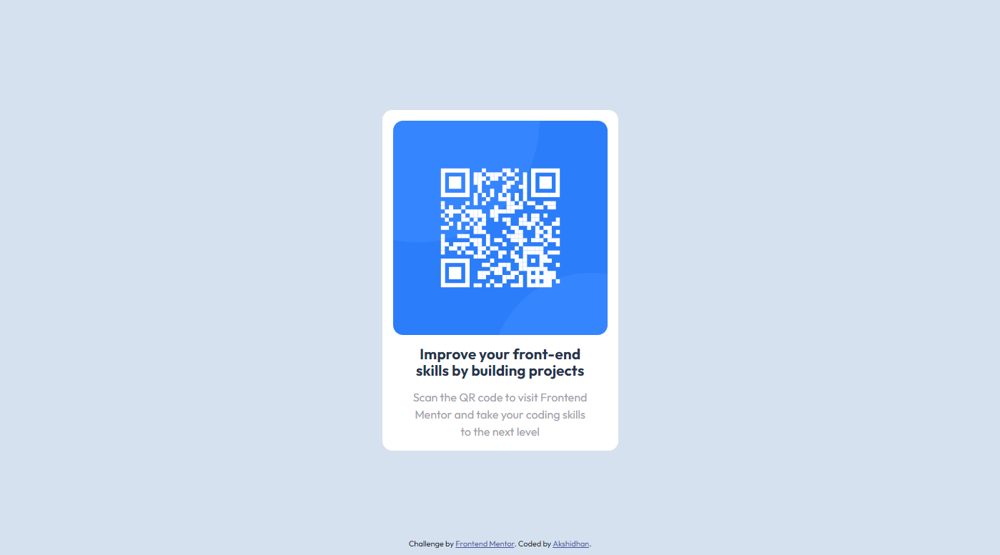

# Frontend Mentor - QR code component solution

This is a solution to the [QR code component challenge on Frontend Mentor](https://www.frontendmentor.io/challenges/qr-code-component-iux_sIO_H). Frontend Mentor challenges help you improve your coding skills by building realistic projects. 

## Table of contents

- [Overview](#overview)
  - [Screenshot](#screenshot)
  - [Links](#links)
- [My process](#my-process)
  - [Built with](#built-with)
  - [What I learned](#what-i-learned)
  - [Continued development](#continued-development)
  - [Useful resources](#useful-resources)
- [Author](#author)
- [Acknowledgments](#acknowledgments)

**Note: Delete this note and update the table of contents based on what sections you keep.**

## Overview

### Screenshot



### Links

- Solution URL: [Add solution URL here](https://your-solution-url.com)
- Live Site URL: [Add live site URL here](https://your-live-site-url.com)

## My process

First, I started with writing the html code for the solution. Added a section inside a div and put all the main components inside the section.

Next I started with the CSS and added the styles to the component

Finally I did the positioning for the component. I positioned it to the center even when the screen size is smaller.

I did a single version for both mobile and desktop version because the design is responsive and can be usable for both type of screens.

### Built with

- Semantic HTML5 markup
- CSS custom properties


### What I learned

Use this section to recap over some of your major learnings while working through this project. Writing these out and providing code samples of areas you want to highlight is a great way to reinforce your own knowledge.

To see how you can add code snippets, see below:

```css
@import url('https://fonts.googleapis.com/css2?family=Outfit:wght@400;700&display=swap');
```


### Continued development

Can make a hover animation for the component

### Useful resources

-

## Author

- Website - Akshidhan(https://github.com/Akshidhan)
- Frontend Mentor - @Akshidhan(https://www.frontendmentor.io/profile/Akshidhan)